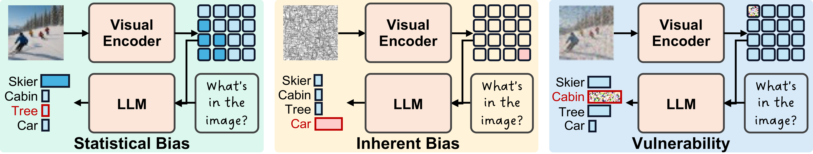
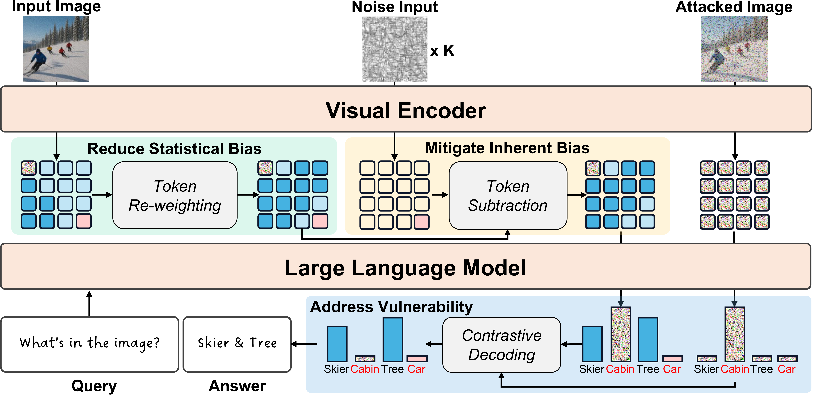

<p align="center">
    
</p>

# SHIELD: Suppressing Hallucinations In LVLM Encoders via Bias and Vulnerability Defense

**First to trace LVLM hallucinations to visual encoders — a training-free framework that fixes statistical bias, inherent bias & vulnerability without any fine-tuning.**

[](https://openreview.net/forum?id=yk7FFLoNcP)
[](https://arxiv.org/abs/2510.16596)
[](https://arxiv.org/pdf/2510.16596)
[](https://openreview.net/forum?id=yk7FFLoNcP)
[](https://hukcc.github.io/SHIELD/)
[](https://github.com/hukcc/SHIELD)
[](LICENSE)
[](https://www.python.org/)
[](https://pytorch.org/)
[](https://github.com/hukcc/SHIELD/issues)

<p align="center">
    
</p>

## Key Results

SHIELD consistently outperforms existing methods across **3 LVLM families** and **6 benchmarks** — all **without training**.

<table>
<tr>
<td>

**CHAIR — LLaVA-1.5 7B** (↓ lower is better)

| Method | C_S | C_I |
|:---|:---:|:---:|
| Vanilla | 48.8 | 14.2 |
| VCD | 46.8 | 13.2 |
| OPERA | 44.6 | 12.8 |
| **SHIELD** | **36.6** | **10.3** |

</td>
<td>

**POPE Avg — LLaVA-1.5 7B** (↑ higher is better)

| Method | Acc | F1 |
|:---|:---:|:---:|
| Vanilla | 81.3 | 79.6 |
| VCD | 84.6 | 84.4 |
| OPERA | 84.7 | 85.4 |
| **SHIELD** | **87.0** | **87.4** |

</td>
</tr>
<tr>
<td>

**MME Hallucination** (↑ higher is better)

| Method | LLaVA-1.5 | Qwen-VL |
|:---|:---:|:---:|
| Vanilla | 565.3 | 587.3 |
| VCD | 604.6 | 596.6 |
| OPERA | 592.3 | 623.3 |
| **SHIELD** | **668.3** | **668.3** |

</td>
<td>

**AMBER Score — LLaVA-1.5 7B** (↑ higher is better)

| Method | Score | CHAIR↓ | Hal.↓ |
|:---|:---:|:---:|:---:|
| Vanilla | 82.0 | 9.2 | 29.2 |
| VCD | 82.9 | 8.1 | 28.6 |
| OPERA | 86.5 | 8.3 | 31.2 |
| **SHIELD** | **88.0** | **6.4** | **25.1** |

</td>
</tr>
</table>

> SHIELD also achieves **1810.8** on MME Full (vs. Vanilla 1632.1, OPERA 1717.2), confirming that hallucination suppression does **not** sacrifice general capability.

## Quick Start

SHIELD works as a **non-invasive wrapper** — no source code modification of LLaVA needed.

```bash
# Run POPE evaluation in one command
bash experiments/scripts/llava1.5_pope_coco.bash

# Run CHAIR evaluation
bash experiments/scripts/llava1.5_chair.bash

# Run MME evaluation
bash experiments/scripts/llava1.5_MME_full.bash
bash experiments/scripts/llava1.5_MME_hal.bash
```

### Python API

```python
import shield
from llava.model.builder import load_pretrained_model

tokenizer, model, image_processor, _ = load_pretrained_model(
    "liuhaotian/llava-v1.5-7b", None, "llava-v1.5-7b"
)

# One-line setup: wrap the model with SHIELD
shield.wrap(model, tokenizer,
    caption_file="experiments/first_cap/llava15_coco_pope_first_caption.jsonl",
    cd_alpha=2.0, cd_beta=0.35,
)

image_tensor = image_processor.preprocess(image, return_tensors="pt")["pixel_values"][0]
shield_kw = model.shield_prepare(image, image_tensor, "image.jpg", use_cd=True)
output_ids = model.generate(input_ids, **shield_kw, do_sample=True, max_new_tokens=1024)
```

## Installation

```bash
conda create -n shield python=3.10
conda activate shield
pip install torch==2.0.1 torchvision==0.15.2 --index-url https://download.pytorch.org/whl/cu118
pip install -r requirements.txt
```

## Data Preparation

The repository includes all text-based metadata. You only need to download **images** and **COCO annotations**.

<details>
<summary><b>Click to expand full data setup instructions</b></summary>

### LLaVA Model

SHIELD uses [LLaVA-1.5](https://github.com/haotian-liu/LLaVA) as the base model. Model weights are automatically downloaded from Hugging Face when first used (`liuhaotian/llava-v1.5-7b`).

### COCO Images & Annotations

COCO val2014 images are shared across POPE (COCO), CHAIR, and LLaVA-Bench evaluations.

1. Download [COCO val2014 images](http://images.cocodataset.org/zips/val2014.zip) and extract to `experiments/data/coco/val2014/`.
2. Download [COCO 2014 annotations](http://images.cocodataset.org/annotations/annotations_trainval2014.zip) and extract to `experiments/data/coco/annotations/`.

```bash
cd experiments/data/coco
wget http://images.cocodataset.org/zips/val2014.zip
unzip val2014.zip

wget http://images.cocodataset.org/annotations/annotations_trainval2014.zip
unzip annotations_trainval2014.zip -d .
mv annotations_trainval2014/annotations .
```

> A pre-built cache (`experiments/eval/chair.pkl`) is included so you can skip COCO annotation download if you only want to run the CHAIR metric.

### POPE

POPE question files for COCO, A-OKVQA, and GQA are already included under `experiments/data/POPE/`. No extra download needed.

For **GQA** images (only needed for POPE-GQA evaluation), download from the [GQA dataset](https://cs.stanford.edu/people/doersch/gqa/images.zip) and extract to `experiments/data/gqa/images/`.

### CHAIR

CHAIR questions are included at `experiments/data/CHAIR/questions.jsonl`. Images come from COCO val2014.

### MME

1. Download the [MME Benchmark](https://github.com/BradyFU/Awesome-Multimodal-Large-Language-Models/tree/Evaluation) images and extract to `experiments/data/MME/MME_Benchmark_release_version/`.
2. MME question lists and evaluation tools are already included.

### LLaVA-Bench

LLaVA-Bench data (images + questions) is fully included in `experiments/data/llava-bench/`. No extra download needed.

### Caption Files

Pre-generated first-round captions for all benchmarks are provided under `experiments/first_cap/`.

### Expected Directory Structure

```
experiments/data/
├── POPE/                          # (included) question files
│   ├── coco/
│   ├── aokvqa/
│   └── gqa/
├── CHAIR/
│   └── questions.jsonl            # (included)
├── MME/
│   ├── full.json                  # (included) question list
│   ├── hal.json                   # (included) question list
│   └── MME_Benchmark_release_version/  # (download)
├── llava-bench/                   # (fully included)
├── coco/
│   ├── val2014/                   # (download) COCO val2014 images
│   └── annotations/              # (download) COCO 2014 annotations
└── gqa/
    └── images/                    # (download) GQA images
```

</details>

## Inference and Evaluation

### POPE

```bash
bash experiments/scripts/llava1.5_pope_coco.bash

python experiments/eval/eval_pope.py \
    --gt_file experiments/data/POPE/coco/coco_pope_random.json \
    --gen_file output/llava15_coco_pope_random_answers_*.jsonl
```

Other POPE splits (popular, adversarial) and datasets (A-OKVQA, GQA) can be run by passing arguments to the script.

### CHAIR

```bash
bash experiments/scripts/llava1.5_chair.bash
```

The CHAIR evaluation script computes CHAIRs, CHAIRi, and Recall metrics. It requires the `pattern` library:

```bash
pip install git+https://github.com/clips/pattern.git
```

### MME

```bash
bash experiments/scripts/llava1.5_MME_full.bash
bash experiments/scripts/llava1.5_MME_hal.bash
```

## Detailed Results

<details>
<summary><b>POPE COCO (all splits, 3 LVLMs)</b></summary>

| LVLM | Method | Rand. Acc | Rand. F1 | Pop. Acc | Pop. F1 | Adv. Acc | Adv. F1 |
|:---|:---|:---:|:---:|:---:|:---:|:---:|:---:|
| LLaVA-1.5 | Vanilla | 83.2 | 81.3 | 81.8 | 80.0 | 78.9 | 77.5 |
| | VCD | 87.7 | 87.1 | 85.3 | 85.0 | 80.8 | 81.3 |
| | OPERA | 89.1 | 89.0 | 86.0 | 86.3 | 79.1 | 80.9 |
| | **SHIELD** | **91.3** | **91.1** | **87.4** | **87.6** | **82.5** | **83.6** |
| InstructBLIP | Vanilla | 80.7 | 80.4 | 78.2 | 78.3 | 75.8 | 76.5 |
| | VCD | 84.5 | 83.6 | 81.4 | 81.0 | 79.5 | 79.5 |
| | OPERA | **89.8** | **89.6** | 83.4 | 84.0 | 80.7 | 81.8 |
| | **SHIELD** | 88.2 | 87.6 | **84.6** | **84.3** | **82.2** | **82.4** |
| Qwen-VL | Vanilla | 84.7 | 82.6 | 84.1 | 82.0 | 82.2 | 80.3 |
| | VCD | 88.6 | 87.8 | 87.1 | 86.4 | 84.2 | 83.9 |
| | OPERA | 86.1 | 84.2 | 85.7 | 83.8 | 83.9 | 82.1 |
| | **SHIELD** | **89.2** | **88.6** | **87.6** | **87.1** | **84.3** | **84.2** |

</details>

<details>
<summary><b>CHAIR (3 LVLMs)</b></summary>

| Method | LLaVA C_S↓ | LLaVA C_I↓ | IBLIP C_S↓ | IBLIP C_I↓ | Qwen C_S↓ | Qwen C_I↓ |
|:---|:---:|:---:|:---:|:---:|:---:|:---:|
| Vanilla | 48.8 | 14.2 | 54.6 | 24.8 | 49.2 | 13.1 |
| VCD | 46.8 | 13.2 | 44.0 | 13.6 | 46.4 | 11.9 |
| OPERA | 44.6 | 12.8 | 46.4 | 14.2 | 34.6 | 9.5 |
| **SHIELD** | **36.6** | **10.3** | **40.4** | **10.9** | **28.9** | **9.2** |

</details>

<details>
<summary><b>MME Hallucination Subset (3 LVLMs)</b></summary>

| LVLM | Method | Existence | Count | Position | Color | Total |
|:---|:---|:---:|:---:|:---:|:---:|:---:|
| LLaVA-1.5 | Vanilla | 175.6 | 124.6 | 114.0 | 151.0 | 565.3 |
| | VCD | 184.6 | 138.3 | 128.6 | 153.0 | 604.6 |
| | OPERA | 180.6 | 133.3 | 123.3 | 155.0 | 592.3 |
| | **SHIELD** | **195.0** | **141.6** | **148.3** | **183.3** | **668.3** |
| InstructBLIP | Vanilla | 141.0 | 75.3 | 66.6 | 97.3 | 380.3 |
| | VCD | 168.3 | **92.3** | 64.0 | 123.0 | 447.6 |
| | OPERA | 156.0 | 78.3 | 55.0 | 95.0 | 384.3 |
| | **SHIELD** | **170.0** | 75.0 | **88.3** | **128.3** | **461.6** |
| Qwen-VL | Vanilla | 155.0 | 127.6 | 131.6 | 173.0 | 587.3 |
| | VCD | 156.0 | 131.0 | 128.0 | 181.6 | 596.6 |
| | OPERA | 165.0 | 145.0 | **133.3** | 180.0 | 623.3 |
| | **SHIELD** | **180.0** | **170.0** | 128.3 | **190.0** | **668.3** |

</details>

<details>
<summary><b>GPT-4o Aided Evaluation</b></summary>

| Method | LLaVA C↑ | LLaVA D↑ | IBLIP C↑ | IBLIP D↑ | Qwen C↑ | Qwen D↑ |
|:---|:---:|:---:|:---:|:---:|:---:|:---:|
| Vanilla | 4.9 | 5.0 | 4.2 | 4.2 | 6.2 | 4.6 |
| VCD | 5.5 | 5.5 | 5.1 | 5.5 | 6.5 | 5.7 |
| OPERA | 5.6 | 6.0 | 5.3 | 5.2 | 6.5 | 5.6 |
| **SHIELD** | **6.2** | **6.1** | **5.6** | 5.3 | **6.9** | **5.8** |

</details>

<details>
<summary><b>MME Full & Efficiency</b></summary>

**MME Full (LLaVA-1.5 7B)**

| Method | Perception↑ | Cognition↑ | Total↑ |
|:---|:---:|:---:|:---:|
| Vanilla | 1279.2 | 352.9 | 1632.1 |
| VCD | 1363.9 | **353.2** | 1717.1 |
| OPERA | 1413.0 | 304.2 | 1717.2 |
| **SHIELD** | **1473.0** | 337.8 | **1810.8** |

**Efficiency (LLaVA-1.5 7B, CHAIR)**

| Method | C_S↓ | Time (s/sample)↓ | Memory↓ |
|:---|:---:|:---:|:---:|
| Vanilla | 48.8 | 2.59 | 15.69 GB |
| VCD | 46.8 | 4.89 | 16.52 GB |
| OPERA | 44.6 | 24.01 | 34.88 GB |
| **SHIELD** | **36.6** | 7.34 | 18.17 GB |

</details>

## Project Structure

```
SHIELD/
├── shield/                      # Core SHIELD library
│   ├── __init__.py              # Public API
│   ├── wrapper.py               # shield.wrap() — non-invasive model patching
│   ├── attack.py                # CW and PGD adversarial attacks in CLIP space
│   ├── caption.py               # Caption loading and preprocessing
│   ├── clip_utils.py            # CLIP model loading and text features
│   ├── feature.py               # Feature weighting, bias computation
│   ├── noise.py                 # Diffusion noise injection
│   └── sampling.py              # Custom contrastive decoding sampler
├── experiments/
│   ├── eval/                    # Evaluation scripts
│   ├── scripts/                 # Bash scripts for running experiments
│   ├── data/                    # Evaluation datasets
│   ├── first_cap/               # Pre-generated first-round captions
│   └── llava/                   # LLaVA model code (vendored)
├── logs/                        # SOTA results for LLaVA, InstructBLIP, Qwen-VL
├── figs/                        # Paper figures
├── requirements.txt
├── CITATION.bib
└── LICENSE
```

## Acknowledgement

We extend our gratitude to the following projects:

- [LLaVA](https://github.com/haotian-liu/LLaVA) — Large Language and Vision Assistant
- [VCD](https://github.com/DAMO-NLP-SG/VCD) — Visual Contrastive Decoding
- [OPERA](https://github.com/shikiw/OPERA) — Alleviating Hallucination in Multi-Modal LLMs
- [CHAIR](https://github.com/LisaAnne/Hallucination) — Object Hallucination evaluation metric
- [Qwen-VL](https://github.com/QwenLM/Qwen-VL) — Qwen Vision-Language model

## Citation

If you find this work useful, please cite our paper:

```bibtex
@inproceedings{
huang2026shield,
title={{SHIELD}: Suppressing Hallucinations In {LVLM} Encoders via Bias and Vulnerability Defense},
author={Yiyang Huang and Liang Shi and Yitian Zhang and Yi Xu and Yun Fu},
booktitle={The Fourteenth International Conference on Learning Representations},
year={2026},
url={https://openreview.net/forum?id=yk7FFLoNcP}
}
```

arXiv version:

```bibtex
@article{huang2025shield,
  title={SHIELD: Suppressing Hallucinations In LVLM Encoders via Bias and Vulnerability Defense},
  author={Huang, Yiyang and Shi, Liang and Zhang, Yitian and Xu, Yi and Fu, Yun},
  journal={arXiv preprint arXiv:2510.16596},
  year={2025}
}
```

## License

This project is released under the [Apache 2.0 License](LICENSE).
